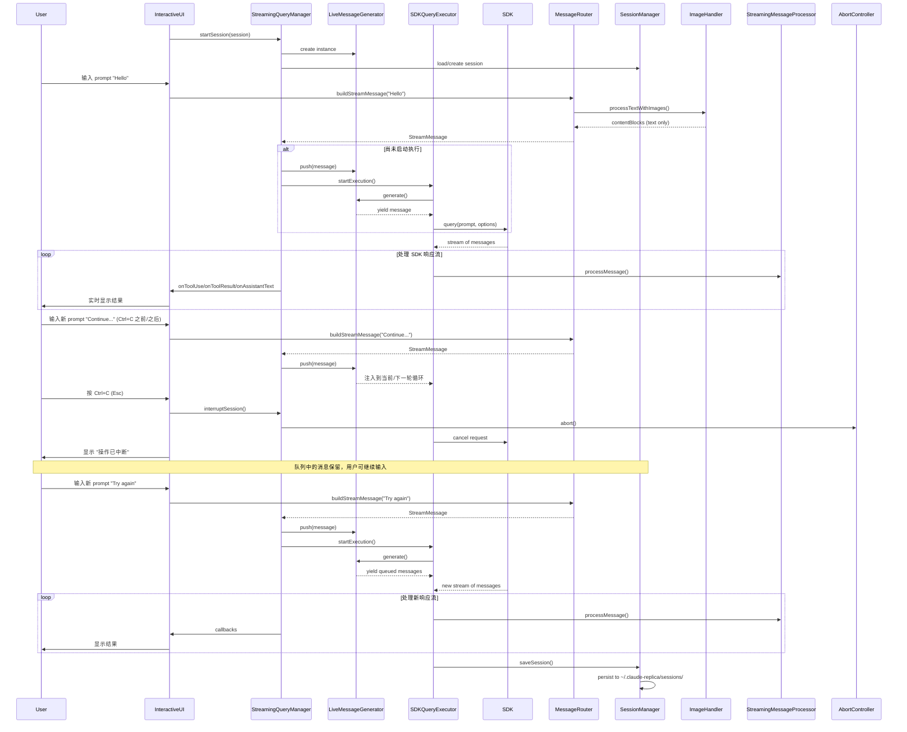
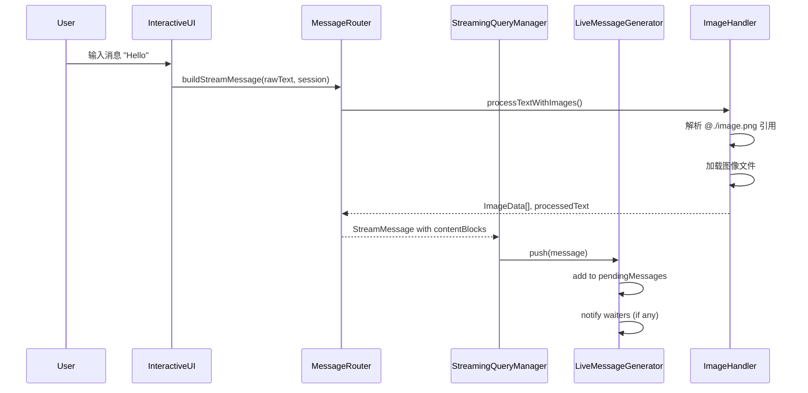
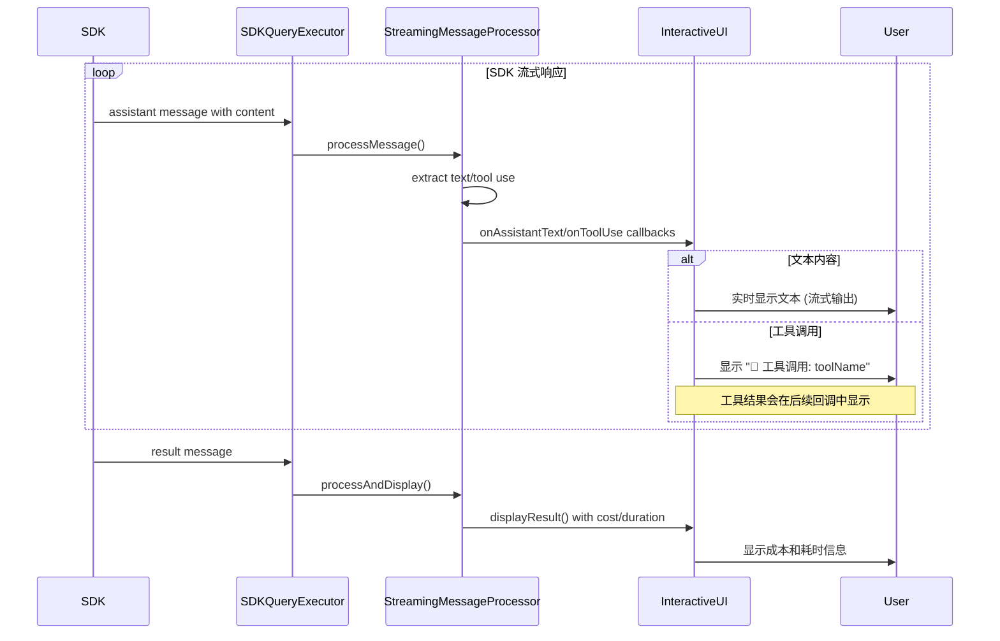
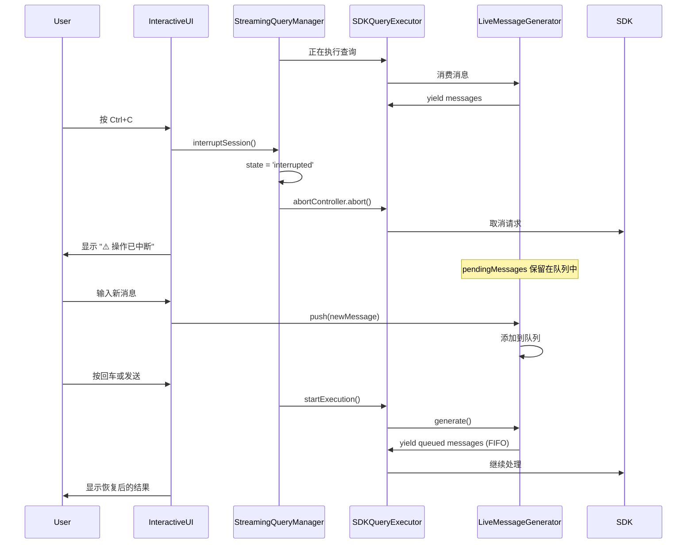

# Claude Replica 流式输入处理机制

## 概述

Claude Replica 实现了真正的流式输入处理机制，允许用户在 AI 助手处理任务的过程中继续输入新的 prompt、发送图片或中断操作。该机制通过 `LiveMessageGenerator` 实现了运行时消息注入，确保消息不会丢失，支持连续对话和中断恢复。

## 核心架构

### 主要组件

1. **InteractiveUI** (`src/ui/InteractiveUI.ts`)
   - 终端交互界面
   - 处理键盘事件（Esc 中断、双击 Esc 回退、Shift+Tab 切换权限）
   - 非阻塞输入支持

2. **StreamingQueryManager** (`src/sdk/StreamingQueryManager.ts`)
   - 流式会话管理器
   - 管理消息队列和会话状态
   - 协调消息处理流程

3. **LiveMessageGenerator** (`src/sdk/StreamingQueryManager.ts`)
   - 实时消息生成器
   - 支持运行时动态注入消息
   - 确保消息不会丢失

4. **MessageRouter** (`src/core/MessageRouter.ts`)
   - 消息路由和构建
   - 图像引用处理（`@./image.png` 语法）
   - 构建 SDK 查询选项

5. **SDKQueryExecutor** (`src/sdk/SDKQueryExecutor.ts`)
   - SDK 查询执行器
   - 处理流式响应
   - 错误分类和中断支持

6. **StreamingMessageProcessor** (`src/core/StreamingMessageProcessor.ts`)
   - 流式消息处理器
   - 实时输出工具调用和结果
   - 节流机制优化显示

## 核心特性

### 1. 真正的流式输入

**关键设计**：消息始终先入队，然后通过 `LiveMessageGenerator` 实时注入到 agent loop 中。

```typescript
// LiveMessageGenerator 核心逻辑
async *generate(): AsyncGenerator<StreamMessage, void, unknown> {
  while (!this.stopped) {
    if (this.pendingMessages.length > 0) {
      // 从队列获取消息
      yield this.pendingMessages.shift()!;
    } else {
      // 等待新消息
      await new Promise<void>((resolve) => {
        this.notifyResolver = resolve;
      });
    }
  }
}
```

### 2. 消息队列机制

- **队列优先**：新消息总是先进入队列
- **FIFO 顺序**：按先进先出顺序处理
- **不丢失**：即使 generator 被中止，消息仍在队列中等待

### 3. 中断支持

支持多级中断机制：

```typescript
// 中断流程
1. InteractiveUI 捕获 Esc 键
2. 调用 handleInterrupt()
3. 中断 StreamingQueryManager
4. 中断 AbortController
5. 中断 SDKQueryExecutor
6. 显示中断状态，保留队列中的消息
```

### 4. 图像处理

支持 `@` 语法引用图像：

```typescript
// 支持的格式
@./image.png     // 相对路径
@/abs/path.png   // 绝对路径
@image.png       // 当前目录

// MessageRouter 自动解析并构建内容块
const buildResult = await imageHandler.processTextWithImages(rawMessage);
```

### 5. 会话恢复

支持从之前的会话恢复：

```typescript
// SDK 会话 ID 持久化
if (sdkResult.sessionId && sdkResult.sessionId !== session.sdkSessionId) {
  session.sdkSessionId = sdkResult.sessionId;
  await this.sessionManager.saveSession(session);
}
```

## 完整流程时序图



## 关键流程说明

### 1. 消息输入流程



### 2. 流式输出流程



### 3. 中断和恢复流程



## 状态管理

### StreamingSession 状态

```typescript
type StreamingSessionState = 'idle' | 'processing' | 'interrupted';
```

- **idle**: 空闲状态，等待用户输入
- **processing**: 正在处理消息
- **interrupted**: 被中断，保留队列消息

### LiveMessageGenerator 状态

```typescript
private stopped = false;
private pendingMessages: StreamMessage[] = [];
private notifyResolver: (() => void) | null = null;
```

- **running**: `stopped = false`，接受新消息
- **stopped**: `stopped = true`，拒绝新消息
- **waiting**: 队列为空，等待通知

## 错误处理

### 错误类型分类

```typescript
enum SDKErrorType {
  NETWORK = 'network',          // 网络错误
  AUTHENTICATION = 'auth',      // 认证错误
  RATE_LIMIT = 'rate_limit',    // 速率限制
  TIMEOUT = 'timeout',          // 超时
  INTERRUPTED = 'interrupted',  // 中断
  UNKNOWN = 'unknown'            // 未知错误
}
```

### 图像错误处理

- **宽容模式**：图像加载失败不影响文本处理
- **错误记录**：将图像错误保存到 `imageErrors` 数组
- **用户提示**：通过 UI 显示图像加载失败的警告

```typescript
if (buildResult.errors && buildResult.errors.length > 0) {
  return {
    success: true,              // 文本消息仍可发送
    imageErrors: buildResult.errors
  };
}
```

## 性能优化

### 1. 节流机制

`StreamingMessageProcessor` 使用节流机制控制输出频率：

```typescript
// 默认 50ms 更新间隔
if (forceFlush || timeSinceLastUpdate >= this.updateIntervalMs) {
  this.flushPendingText();
}
```

### 2. 缓冲区管理

- **pendingText**: 累积待输出的文本
- **批量输出**: 减少系统调用次数
- **强制刷新**: 在工具调用和结果前强制输出

### 3. 消息批处理

- **队列批量**：一次性处理多个消息
- **生成器复用**：避免重复创建 AsyncGenerator
- **内存管理**：及时清理工具调用映射

## 配置选项

### StreamingMessageProcessor

```typescript
interface StreamingMessageProcessorOptions {
  outputHandler?: OutputHandler;           // 自定义输出处理器
  showToolDetails?: boolean;              // 显示工具详情
  showCostInfo?: boolean;                 // 显示成本信息
  enableStreaming?: boolean;               // 启用流式输出
  includePartialMessages?: boolean;       // 处理部分消息
  updateIntervalMs?: number;               // UI 更新间隔
}
```

### StreamingQueryManager

```typescript
interface StreamingQueryManagerOptions {
  messageRouter: MessageRouter;
  sdkExecutor: SDKQueryExecutor;
  onToolUse?: (info: ToolUseInfo) => void;
  onToolResult?: (info: ToolResultInfo) => void;
  onAssistantText?: (text: string) => void;
  onThinking?: (content?: string) => void;
}
```

## 最佳实践

### 1. 消息发送

```typescript
// 推荐：异步发送，不等待结果
streamingQueryManager.sendMessage("prompt");

// 或使用队列接口
streamingQueryManager.queueMessage("prompt");
```

### 2. 中断处理

```typescript
// 检查是否正在处理
if (streamingQueryManager.isProcessing()) {
  streamingQueryManager.interruptSession();
}
```

### 3. 结果获取

```typescript
// 异步等待结果
const result = await streamingQueryManager.waitForResult();

// 或获取最新结果（不等待）
const lastResult = streamingQueryManager.getLastResult();
```

### 4. 队列管理

```typescript
// 获取队列长度
const queueLength = streamingQueryManager.getQueueLength();

// 检查活跃会话
const activeSession = streamingQueryManager.getActiveSession();
```

## 测试覆盖

### 单元测试

- `SDKQueryExecutor` 错误分类和中断
- `LiveMessageGenerator` 消息生成和队列
- `MessageRouter` 图像处理和消息构建

### 集成测试

- 端到端流式查询
- 消息队列 FIFO 顺序
- 会话中断和恢复
- 图像引用处理

### 终端测试

- 实际终端交互（node-pty）
- 键盘事件捕获
- 非阻塞输入验证

## 总结

Claude Replica 的流式输入处理机制通过 `LiveMessageGenerator` 和消息队列实现了真正的非阻塞输入，支持：

1. ✅ 运行时消息注入
2. ✅ 消息不丢失保证
3. ✅ 多级中断支持
4. ✅ 图像引用处理
5. ✅ 会话恢复
6. ✅ 实时工具调用显示
7. ✅ 节流和性能优化
8. ✅ 完善的错误处理

该机制确保用户在 AI 助手工作过程中可以持续交互，支持复杂的多轮对话和任务中断恢复场景。
