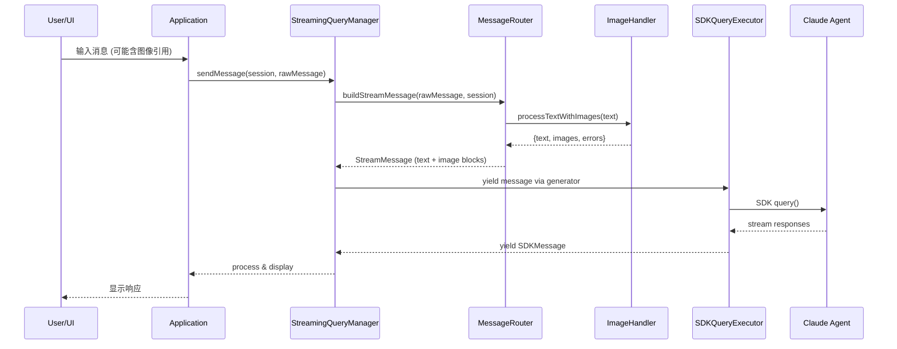

## 背景

Claude Agent SDK 提供两种输入模式：
1. **单消息输入**：传递字符串 `prompt`，适用于简单的一次性查询
2. **流式输入模式**（推荐）：传递 `AsyncGenerator`，支持持久会话、图像上传、消息队列、钩子集成

当前项目使用单消息输入模式，限制了以下能力：
- 无法在消息中直接附加图像
- 无法动态排队多条消息
- 无法使用钩子集成
- 缺乏自然的多轮对话上下文持久性

## 目标 / 非目标

### 目标
- 实现流式输入模式作为主要 SDK 调用方式
- 支持在用户消息中附加图像（通过 `@./image.png` 语法或交互式粘贴）
- 支持消息队列，允许按顺序处理多条消息
- 集成钩子系统到流式查询流程
- 保持向后兼容，单消息输入作为简化接口

### 非目标
- 实现自动图像压缩/调整大小（已有 `ImageHandler` 支持）
- 修改 MCP 服务器集成方式
- 修改子代理调用逻辑

## 决策

### 决策 1：流式输入架构

**选择**: 创建 `StreamingQueryManager` 类作为流式输入的管理器

**理由**:
- 分离关注点：`SDKQueryExecutor` 专注于底层 SDK 调用，`StreamingQueryManager` 管理会话和消息流
- 更好的可测试性
- 允许灵活的消息生成策略

**替代方案**:
- 直接在 `Application` 中实现 AsyncGenerator：会导致 Application 类过大，职责不清晰

### 决策 2：图像集成方式

**选择**: 在 `MessageRouter.buildStreamMessage()` 中集成 `ImageHandler`

**理由**:
- 复用现有的图像处理逻辑
- 统一消息构建入口
- 便于错误处理和用户反馈

### 决策 3：向后兼容策略

**选择**: 保留 `SDKQueryExecutor.execute(options: SDKQueryOptions)` 方法，内部转换为流式输入

**理由**:
- 非交互模式和 CI 环境仍可使用简化接口
- 渐进式迁移，降低风险

## 类结构设计

```
┌──────────────────────────────────────────────────────────────────┐
│                        Application                                │
│  - streamingQueryManager: StreamingQueryManager                   │
│  - handleUserMessage(message, session)                            │
└────────────────────────┬─────────────────────────────────────────┘
                         │
                         ▼
┌──────────────────────────────────────────────────────────────────┐
│                    StreamingQueryManager                          │
│  - messageRouter: MessageRouter                                   │
│  - sdkExecutor: SDKQueryExecutor                                  │
│  - imageHandler: ImageHandler                                     │
│                                                                   │
│  + startSession(session): StreamingSession                        │
│  + sendMessage(session, message): void                            │
│  + queueMessage(session, message): void                           │
│  + interruptSession(session): void                                │
└────────────────────────┬─────────────────────────────────────────┘
                         │
                         ▼
┌──────────────────────────────────────────────────────────────────┐
│                      SDKQueryExecutor                             │
│  + executeStreaming(generator, options): AsyncGenerator           │
│  + execute(options): Promise<SDKQueryResult>  [兼容接口]          │
└──────────────────────────────────────────────────────────────────┘
```

## 消息流程



## 风险 / 权衡

### 风险 1：破坏性变更
- **风险**: 修改 `SDKQueryExecutor` 签名可能影响现有测试
- **缓解**: 保留兼容接口，分阶段迁移测试

### 风险 2：复杂性增加
- **风险**: 流式输入增加代码复杂性
- **缓解**: 清晰的分层设计，详细的代码注释

### 风险 3：图像处理性能
- **风险**: 大图像可能阻塞消息处理
- **缓解**: 使用现有的 `ImageHandler` 大小限制（20MB）

## 迁移计划

1. **阶段 1**: 添加 `StreamingQueryManager` 和流式执行方法，不修改现有接口
2. **阶段 2**: 在 `Application` 交互模式中集成流式输入
3. **阶段 3**: 迁移非交互模式使用新接口（内部实现，外部兼容）
4. **阶段 4**: 更新测试，移除废弃代码

**回滚**: 每个阶段独立，可单独回滚

## 开放问题

1. 是否需要实现消息队列的优先级机制？（建议：当前不需要，FIFO 即可）
2. 图像粘贴功能是否需要在 CLI 交互模式中支持？（建议：首先支持 `@` 语法，粘贴作为后续功能）

